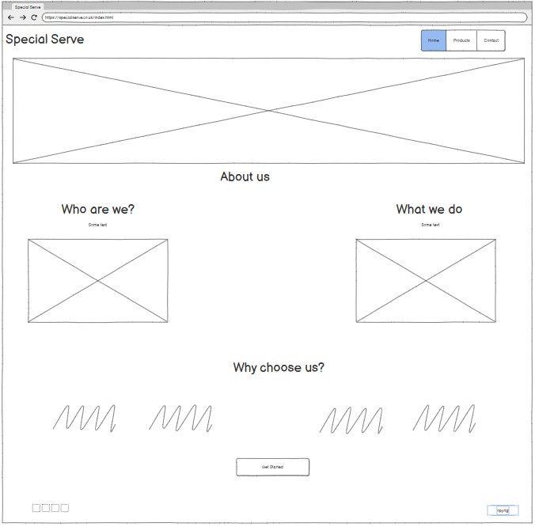
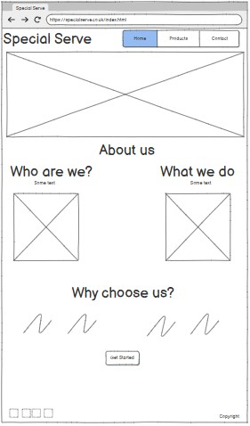
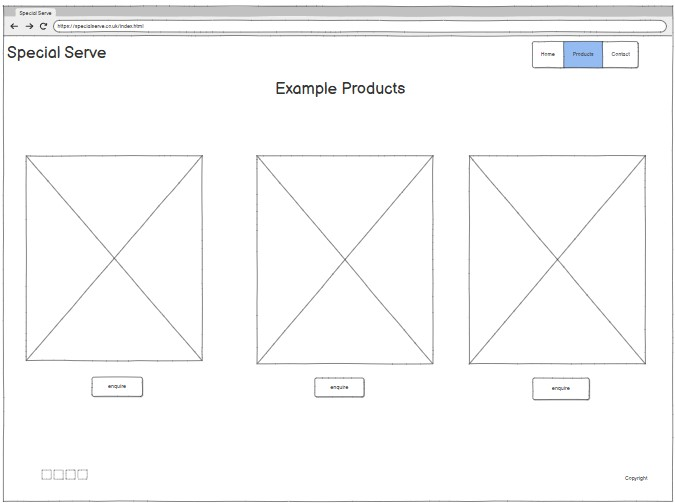
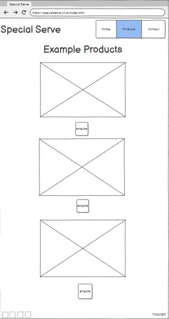
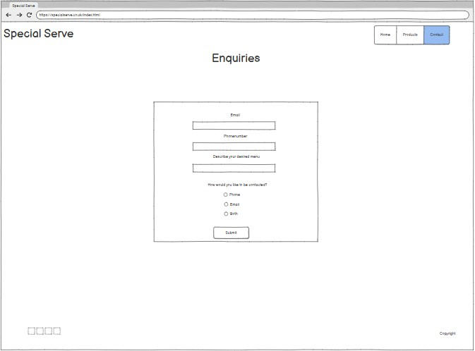
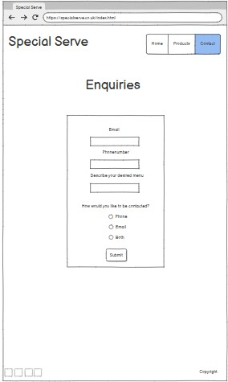
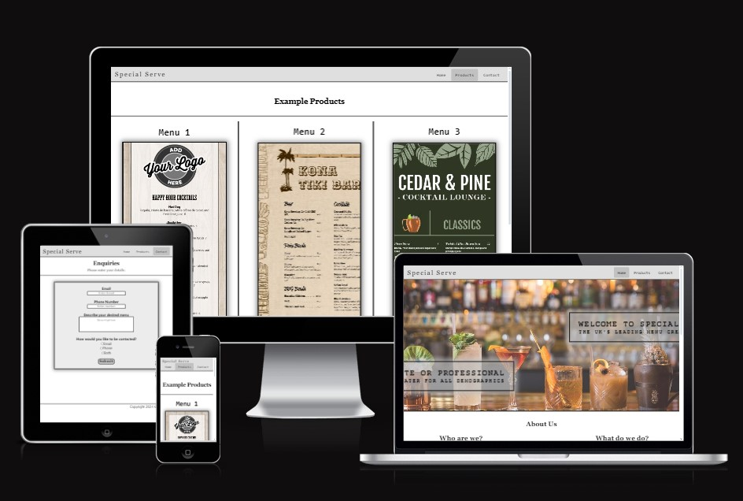

# Milestone 1 Project - Cocktail Menu Provider Website 

- This project consists of 4 different content pages, describing and detailing the products and services laid out by this psuedo comapny.

## User stories
As the sole developer of this website, my goal is to secure employment opportunities in the web development area as well as other potential employment in the area of IT.
I came up with the following points, which are applicable to the users:

- As a user, I want to understand the purpose of this website quickly and easily.
- As a user, I want to easily navigate this website (by using a mouse, a keyboard, or a touch screen).
- As a user, I want to view this businesses offerings and how to access them.
- As a user, I want a way to contact this business.
- As a user, I want to get foster an understanding of the products I can recieve.

## UX

- There are two user groups targeted by this website. They are personal and business clients.
- The site is focused on simplicity and ease of navigation for the products available.

## Wireframes

- I have used the same wireframe for both mobile and tablet resolutions as I intend to display the same content for both sizes

- Index page wireframe
- - 
- Index page wireframe Mobile & Tablet
- - 

- Products page wireframe
- - 
- Products page wireframe Mobile & Tablet
- - 

- Contact page wireframe
- - 
- Contact page wireframe Mobile & Tablet
- - 

## Demo

### A live demo to the website can be found [here](https://ljkkj7.github.io/Milestone-Project-1.github.io/index.html)

**Website Sections:**
1. **_Home / Landing page:_** A simple introduction about about the companies history, what they offer and their expertise.
2. **_Products:_** A page displaying three examples of the products offered.
3. **_Contact:_** A form displaying the information needed for the client to contact the business.

## Technologies
1. HTML - To create a basic site
2. CSS - To create a nice, standout front-end and to give a great user experience

## Testing
* I tested the site, and it works in different web browsers: Chrome, Firefox, and Microsoft Edge.
* On mobile devices, I tested the my site on multiple mobile devices offered by the dev tools of google chrome
- 
- 
- 
- 
* I confirmed that the site is responsive and functions on different screen sizes using the devtools device toolbar.
* I confirmed that the navigation and the sections Home, Products and Contact are readable and easy to understand.
- 
- 
- 
* I confirmed that the form works: it requires entries in every field, only accepts an email in the email field, and the submit buttons work.
- 
- 
- 
- 

- ## CSS Validation testing

- ## HTMl Validation testing

- ## Lighthouse testing

## Deployment
* The site was deployed to Git Hub pages using the following steps:
  * In the Github repository, the Stetting tab.
  * Under General, navigate to Code and Automation and select 'Pages'.
  * In the Build and Deployment section for Source, select 'Deploy from a branch' from the drop-down list.
  * For Branch, select 'main' from the drop-down list and Save.
  * On the top of the page, the link to the complete website is provided.
  
  - The deployed site will update automatically upon new commits to the master branch.

## Testing User Stories

-  ## As a user, I want to understand the purpose of this website quickly and easily.
  - When landing on the first page of the website the user is greeted with this hero image

  - This clearly demonstrates the product of the company and the quality of their product
  - Scrolling down from here, the user is presented with a more detailed description of who and what the company do and are

  - Scrolling down even further, the user is presented with detailed information about the companies accolades and why they should choose them

  - I believe this successfully demonstrates to the user:
    - The purpose of the website (Cocktail menu creation)
    - What the company has achieved
    - How the company benefits the user
  - Doing this within 3 sections of one page, I believe this also touches on every point efficiently

-  ## As a user, I want to easily navigate this website (by using a mouse, a keyboard, or a touch screen).
  - The website can be easily navigable through the use of the buttons on the navbar as shown below

  - Additionally, there are multiple CTA buttons that drive the users to the required pages based on context
  - ### CTA 1

  - ### CTA 2

- ## As a user, I want to view this businesses offerings and how to access them.
  - Following the natural flow of the website to the bottom of the index page - the user will find the get started button

  - This brings them to the products page where the user can easily see the example products being offered by the business

- ## As a user, I want a way to contact this business.
 - Contained inside the navigation bar there is a button that links to the contact page
 - Additionally, Underneath the exmaple product menus there is 3 CTA buttons that redirect to the contact page
 - Inside the contact page there is a form containing which details need to be entered in order for the user to contact the business

- ## As a user, I want to get foster an understanding of the products I can recieve.
  - As laid out in the index page, there is 2 sections deatiling who the company are, what they do and what the user can look to them for

  - Additionally, in the products page the user can ascertain what type of product is being offered

## Bug Fixes
- Initially, I was having problems with deployment to GitHub Pages. My CSS pages werent displaying properly as they were oh GitPod.
  * To combat this discrepancy, I combed through my code to indentify any syntax errors that could be causing the disconnect.
  * Following this, I Identified there was an error in the way I was referencing the stylesheets filepaths.
  * GitPod was allowing me to deploy locally through the use of a single "/" prefix
  * To fix this I added a "." to instruct the webpage to come out by one file path and re-enter the correct folder

- To address the large amount of commits on one day and the low commit count -
  * I was running into an error with GitPod whereby my commits that I was making were not being synced to my GitHub repository
  * To address this, I sought support from fellow students on slack and scheduled a project review meeting with my mentor
  * This again, was a syntax error in which my commit messages werent being saved and therefore, not uploaded to the main GitHub repository

- There was a slight issue with the font awesome icon library not displaying the icons in the footer
  * To combat this I researched common problems with using the font awesome library and came across a solution
  * Instead of referencing the fontawesome script, I linked to a stylesheet hosted on an external server

- I had trouble fixing the descendacy issue concerning the anchor tags and HTML validation
  * After some research I found the best course of action was to style the anchor tag as a button using my CSS files

## Known Bugs

- Assets & Images files are capitalised due to an issue changing the file names when uploading using Git in VSCode

## External Code Used
1. [Centering divs using top, bottom and transform](https://blog.hubspot.com/website/center-div-css)
2. Love Running CI Example CSS
3. [Pure CSS Slideshow](https://codepen.io/sarat1669/pen/bpzgGg)
3. [Img popout CSS](https://stackoverflow.com/questions/64582068/how-to-make-an-image-pop-out-inside-a-div)
